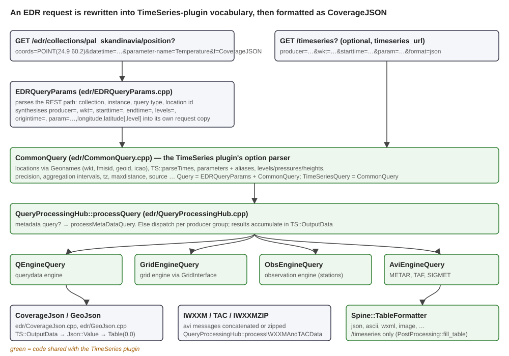
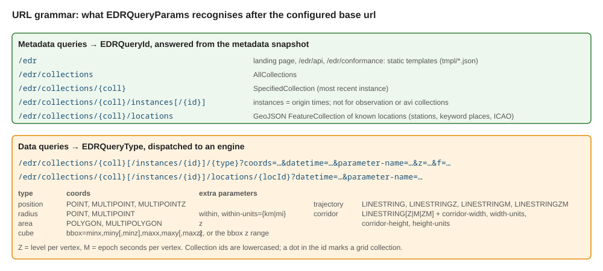
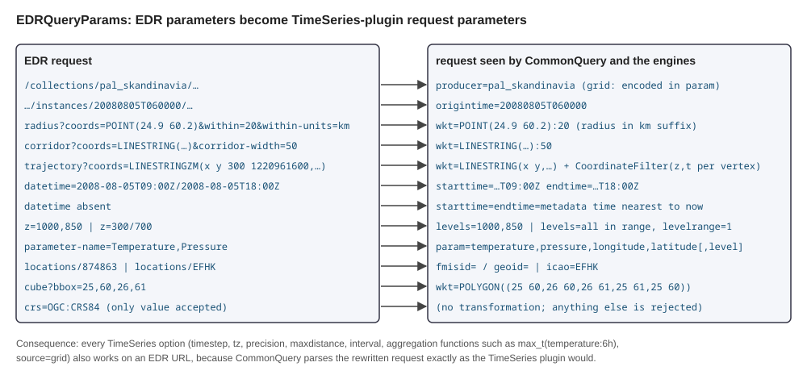
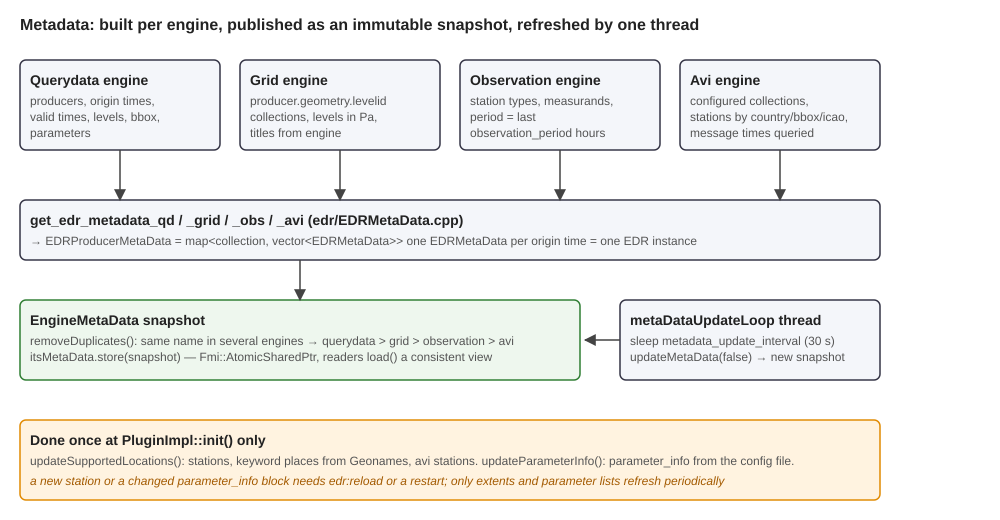
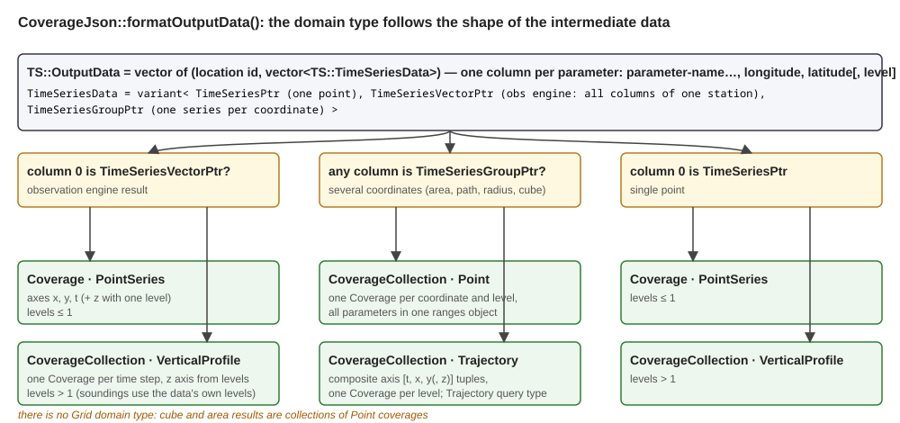

# EDR plugin: a programmer's tutorial

This tutorial explains how a request to the EDR plugin becomes a CoverageJSON document,
from the REST path to the engines and back. It is written for programmers who are about
to add a query type, an output detail, a metadata field or a configuration key, or who
need to understand why a response has the shape it has. It complements
[Using-EDR-Plugin.md](Using-EDR-Plugin.md), which documents the request vocabulary, and
[EDR-Plugin-Configuration-Guide.md](EDR-Plugin-Configuration-Guide.md), which documents
the configuration file.

The plugin produces no pictures, so the figures here are diagrams of the code paths.
Their SVG sources are next to the PNGs in `docs/images/tutorial/` and can be edited.

All file paths are relative to the plugin root. The example request used throughout is
the test `pal_skandinavia_one_point`:

```
GET /edr/collections/pal_skandinavia/position?coords=POINT(24.9384 60.1699)&datetime=200808051200&parameter-name=Temperature
```

| Role | Path |
|------|------|
| Request | `test/base/input/pal_skandinavia_one_point.get` |
| Expected CoverageJSON | `test/base/output/pal_skandinavia_one_point.get` |
| Collection metadata | `test/base/input/metadata_pal_skandinavia.get` and its output |
| Test configuration | `test/base/cnf/edr.conf` |
| Static templates | `tmpl/home.json`, `tmpl/api.json`, `tmpl/conformance.json`, `tmpl/problemdetail.json` |

## Contents

1. [The pipeline in one picture](#1-the-pipeline-in-one-picture)
2. [The plugin is a TimeSeries plugin with an EDR front end](#2-the-plugin-is-a-timeseries-plugin-with-an-edr-front-end)
3. [Parsing the URL](#3-parsing-the-url)
4. [Translating EDR parameters](#4-translating-edr-parameters)
5. [Metadata: collections, instances, locations](#5-metadata-collections-instances-locations)
6. [Dispatching to engines](#6-dispatching-to-engines)
7. [The intermediate representation](#7-the-intermediate-representation)
8. [CoverageJSON output](#8-coveragejson-output)
9. [Other outputs: GeoJSON, TAC, IWXXM](#9-other-outputs-geojson-tac-iwxxm)
10. [Static documents and the custom JSON class](#10-static-documents-and-the-custom-json-class)
11. [Precision, aggregation and post-processing](#11-precision-aggregation-and-post-processing)
12. [Configuration](#12-configuration)
13. [Caching, ETags, reload](#13-caching-etags-reload)
14. [Tests](#14-tests)
15. [Extending the plugin](#15-extending-the-plugin)
16. [Gotchas](#16-gotchas)

---

## 1. The pipeline in one picture



`Plugin` in `edr/Plugin.cpp` is a thin shell around `PluginImpl`, held in an atomic
shared pointer so that the whole implementation can be rebuilt and swapped on reload
(section 13). `PluginImpl::requestHandler` in `edr/PluginImpl.cpp` receives every
request under the configured EDR URL and, when `timeseries_url` is set, a second handler
serves the TimeSeries plugin interface from the same code. The interesting work happens
in four stages:

1. `EDRQueryParams` parses the REST path and rewrites the EDR query parameters into the
   TimeSeries plugin's request vocabulary (sections 3 and 4).
2. `CommonQuery` parses that rewritten request exactly as the TimeSeries plugin would,
   resolving locations through the Geonames engine and times through the timeseries
   library.
3. `QueryProcessingHub` answers metadata queries from an in-memory snapshot, or
   dispatches data queries to one of four engine-specific query classes, collecting
   results in `TS::OutputData` (sections 6 and 7).
4. `CoverageJson` or `GeoJson` turns that data into a document, which is placed in cell
   (0,0) of a `Spine::Table` and written out with the `ascii` formatter (section 8).

---

## 2. The plugin is a TimeSeries plugin with an EDR front end

Understanding this one fact makes the rest of the code legible. The plugin was forked
from the TimeSeries plugin, and the engine query classes (`QEngineQuery`,
`GridEngineQuery` with `GridInterface`, `ObsEngineQuery`, `AviEngineQuery`), the
option parser (`CommonQuery`, `ObsQueryParams`), the location tools and the
post-processing are that plugin's code. EDR support is a layer that:

- parses `/edr/collections/...` paths instead of `/timeseries?...` parameters,
- synthesises `producer=`, `wkt=`, `starttime=`, `levels=` and `param=` for the shared
  parser,
- adds metadata (collections, instances, locations) that the TimeSeries plugin never
  needed,
- and formats the result as CoverageJSON or GeoJSON instead of a table.

The class `Query` in `edr/Query.h` makes the layering explicit:

```cpp
class Query : public EDRQueryParams, public CommonQuery
Query::Query(const State& state, const Spine::HTTP::Request& request, Config& config)
    : EDRQueryParams(state, request, config),
      CommonQuery(state, EDRQueryParams::req, config)
{
  format = "ascii";                       // the JSON document travels in a one-cell table
  if (isEDRMetaDataQuery()) return;
  commonInit(state, EDRQueryParams::req, config, 0.0, true, avi_lambda);
}
```

Base-class order matters: `EDRQueryParams` fills its own copy `req` of the request, and
`CommonQuery` then parses that copy. `TimeSeriesQuery` derives from `CommonQuery` alone.
The flag `CommonQuery::is_timeseries_query` tells shared code which interface was hit
where the two legitimately differ.

A practical consequence: every TimeSeries option also works on an EDR URL, because the
rewritten request goes through the same parser. `timestep`, `tz`, `precision`,
`maxdistance`, `interval`, `source=grid` and aggregation functions such as
`max_t(temperature:6h)` in `parameter-name` are all honoured, even though the EDR
documentation does not mention them.

---

## 3. Parsing the URL



`EDRQueryParams::EDRQueryParams` in `edr/EDRQueryParams.cpp` does the following:

1. `resolve_host` builds the absolute base URL for links from `X-Forwarded-Proto`, the
   `Host` header and an optional API key segment. Without a `Host` header it falls back
   to a hard-coded FMI address, which is why test outputs contain that host.
2. If the resource matches one of the `api.items` entries in the configuration (landing
   page, `/api`, `/conformance`), the query is an `APIQuery` served from a template
   (section 10).
3. Otherwise the path is split after the base URL. `collections` must be the first
   segment. The next segments select the collection (lowercased), then either
   `instances[/{id}]`, `locations[/{id}]` or a data query type.
4. `is_data_query` decides whether a `/locations` URL without an id is metadata (a
   FeatureCollection of known locations) or whether a data query follows. Its header
   comment is the most compact statement of the grammar and is reproduced in the figure.
5. For a data query under `/instances/{id}`, the instance id is added to the request as
   `origintime`. This is how EDR instances map onto model runs.
6. The query type is checked against `data_queries` for the collection in the
   configuration; an unsupported type yields a 400 listing the allowed ones.

Metadata queries stop here with an `EDRQueryId` set. Data queries continue into the
translation of section 4.

Two details worth knowing: collection ids are compared in lowercase, so `METAR` in a
URL selects the collection `metar`; and grid engine collections are recognised by a dot
in their id (`producer.geometry.levelid`), which is the sole discriminator used when
deciding how to encode the producer.

---

## 4. Translating EDR parameters



The translation lives in the second half of the `EDRQueryParams` constructor and its
helpers. The important mappings:

| EDR | Internal request | Where |
|---|---|---|
| collection id | `producer=` (querydata, observation, avi); grid producers are embedded in the parameter names | ctor |
| `coords=POINT/MULTIPOINT` | `wkt=` | `parsePosition` |
| `coords=...&within=20&within-units=km` | `wkt=POINT(...):20`, the radius in kilometres appended to the WKT for the Geonames parser | `parseCoords` |
| `coords=LINESTRING&corridor-width=50` | `wkt=LINESTRING(...):50` | `parseCoords` |
| `LINESTRINGZ`, `LINESTRINGM`, `LINESTRINGZM`, `MULTIPOINTZ` | 2-D WKT plus a `CoordinateFilter` holding level and epoch time per vertex | `parseTrajectoryAndCorridor`, `parsePosition` |
| `corridor-height`, `height-units` | `z=lo/hi` in the collection's level unit | `parseCoords` |
| `bbox=minx,miny[,minz],maxx,maxy[,maxz]` (cube) | `wkt=POLYGON(...)` and optionally the z range | `parseCube` |
| `datetime=a/b`, `a/..`, `../b`, instant | `starttime=`, `endtime=`, with `data` for open ends | `parseDateTime` |
| `datetime` absent | the metadata time nearest to now (avi: `usecurrenttime=1`); for `LINESTRINGM/ZM` the vertex times | `parseDateTime` |
| `z=850`, `z=1000,850`, `z=300/700`, `z=R5/300/100` | `levels=` (a range expands to the metadata levels inside it, with `levelrange=1`) | `parseParameterNamesAndZ` |
| `parameter-name=A,B` | `param=a,b,longitude,latitude[,level]`; unknown names are dropped with a log line | `cleanParameterNames` |
| `locations/{id}` | `fmisid=`, `geoid=` or `icao=` depending on the location's type; `qdstation` becomes a position query | `parseLocations` |
| `f=` | `output_format` and the MIME type; validated against `output_formats` for the collection | ctor |
| `crs=` | must be `OGC:CRS84` or `CRS:84`; anything else, including `EPSG:4326`, is rejected. Coordinates are never transformed. | `parseCoords` |

The `CoordinateFilter` (`edr/CoordinateFilter.cpp`) deserves a note. WKT with Z or M
values cannot be passed to the Geonames parser, so the constructor strips them and
remembers, per vertex, which level and which time are wanted. After the engines have
returned data for all vertices and all times, the formatter uses the filter to keep
only the requested combinations. It also supplies the default `datetime` and `levels`
when those parameters are absent.

`longitude` and `latitude` are always appended to `param` because the formatter needs
the coordinates of every returned point; `level` is appended when the collection has a
vertical extent so that multi-level results can be unflattened later.

---

## 5. Metadata: collections, instances, locations



### 5.1 Data model

`EDRMetaData` in `edr/EDRMetaData.h` describes one collection at one origin time:
spatial, temporal and vertical extents, parameter names and descriptions, the supported
`data_queries` and `output_formats` from configuration, pointers to the location list
and configured collection and parameter info, and the source engine. A collection is a
`std::vector<EDRMetaData>`, one element per origin time, and that vector is what EDR
calls the collection's **instances**. `sourceHasInstances` is false for observation and
avi collections, so `/instances` is rejected for them.

### 5.2 Construction

`edr/EDRMetaData.cpp` has one builder per engine:

- `get_edr_metadata_qd` walks the querydata engine's producer metadata: valid times are
  grouped into constant-step runs that become `R{n}/{start}/PT{step}M` strings, the
  allowed `timestep` values are derived from them, levels become a vertical extent only
  when there is more than one, and the bounding box comes from the data's WGS84
  envelope.
- `get_edr_metadata_grid` builds `producer.geometry.levelid` collections with levels
  taken from GRIB (pressure in pascals) and titles supplied by the engine.
- `get_edr_metadata_obs` queries station types and measurands; the temporal extent is
  the last `observation_period` hours ending now, and sounding producers get a pressure
  level range.
- `get_edr_metadata_avi` builds collections from the `avi` configuration block, lists
  stations by country, bounding box or ICAO code, and **queries the message times over
  `period_length` days** to construct the temporal extent, merged into at most 300
  periods. This is the expensive part of every refresh.

`EngineMetaData::removeDuplicates` resolves a collection name present in several
engines in the priority order querydata, grid, observation, avi.

### 5.3 Publication and refresh

`PluginImpl::updateMetaData` builds a fresh `EngineMetaData`, runs the four builders,
removes duplicates and stores the result in an `Fmi::AtomicSharedPtr`. Readers call
`load()` and get an immutable snapshot, so a request never sees a half-built metadata
set. The thread `metaDataUpdateLoop` repeats this every `metadata_update_interval`
seconds (30 by default) unless `metadata_updates_disabled` is set, which the tests do.

Two things are built **only at init**: the location lists (`updateSupportedLocations`,
which reads observation stations, station lists embedded in point querydata, Geonames
keyword searches and avi stations) and the configured parameter info
(`updateParameterInfo`). A new station or an edited `parameter_info` block therefore
needs `edr:reload` or a restart.

### 5.4 Rendering

`CoverageJson::parseEDRMetaData` and its helpers produce the collection documents. The
expected output for `/edr/collections/pal_skandinavia` shows the structure: `id`,
`title` and `description` from `collection_info`, `links` including the license,
`output_formats`, `keywords` (configured keywords **plus every parameter name**),
`crs`, `extent` with spatial, temporal and vertical parts, `data_queries` with one
entry per supported query type carrying a `link` whose `variables` describe the
accepted `coords` and `crs_details`, and `parameter_names` with unit and description
resolved in the order configuration, engine, bare name. The instance list gives each
origin time a title of the form `Origintime: ... Starttime: ... Endtime: ...`, and the
`instances` link only appears when a collection has more than one origin time.

`/locations` renders a GeoJSON FeatureCollection with one feature per known location,
including its temporal validity where available. For avi collections the special id
`all` becomes an area query over the collection's bounding box.

---

## 6. Dispatching to engines

`QueryProcessingHub::processQuery` in `edr/QueryProcessingHub.cpp` first short-circuits
metadata queries to `processMetaDataQuery`. For data queries it loads the collection's
`EDRMetaData`, validates `timestep` against the metadata's allowed set, clears `levels`
for collections without a vertical extent, and then iterates the producer groups the
parser built:

```cpp
for (const AreaProducers& areaproducers : masterquery.timeproducers)
{
  Query q = masterquery;
  if (itsAviEngineQuery.isAviProducer(producerName) && !aviEngineDisabled())   processAviEngineQuery(...);
  else if (!obsEngineDisabled() && isObsProducer(areaproducers.front()))        processObsEngineQuery(...);
  else if (itsGridEngineQuery.isGridEngineQuery(areaproducers, masterquery))   processGridEngineQuery(...);
  if (process_qengine_query)                                                    itsQEngineQuery.processQEngineQuery(...);
}
```

The rules are: avi if the producer exists in the avi metadata; observation if the
producer is a known station type; grid if the grid engine is enabled and either
`source=grid` was given, a grid producer or parameter is referenced, or no producer was
named and `primaryForecastSource` is `grid`; otherwise querydata.

How each engine realises the EDR query types differs, and the table below is the
quickest way to see where to look when a type misbehaves for one source only:

| Query type | Querydata (`edr/QEngineQuery.cpp`) | Observation (`edr/ObsEngineQuery.cpp`) | Grid (`edr/GridEngineQuery.cpp`, `GridInterface.cpp`) | Avi (`edr/AviEngineQuery.cpp`) |
|---|---|---|---|---|
| position | interpolation at the point; MULTIPOINT handled as a path whose vertices are the points | nearest station per point | one `QueryServer::Query` per location | nearest station within 1 km |
| radius | area query with a buffered point and `NFmiIndexMaskTools::MaskExpand` over the grid | stations inside the buffered point | `Circle`/`Polygon` location with radius | nearest station within the radius |
| area, cube | grid points inside the polygon; cube adds `levels` | stations inside the polygon; levels ignored | polygon location; one parameter name per level; the level loop stops after the first pass for EDR | WKT passed to the avi engine |
| trajectory | vertices sampled from the path, then `Q::values(param, locations, times)` | path buffered by 200 m, stations inside | `Path` location | WKT |
| corridor | path WKT with width suffix, buffered geometry | stations inside the buffer | `Path` or `Polygon` with radius | WKT plus maximum distance |
| locations | converted to position or station queries | `fmisid` | position | `icao` list |

Levels are handled differently per source as well. Querydata iterates levels in
`fetchQEngineValues` and `PostProcessing::store_data` **concatenates** the per-level
series into one column, level-major. Grid encodes each level as a separate parameter
name and column. The formatters know both layouts.

---

## 7. The intermediate representation



Everything the engines return ends up in `TS::OutputData`, a vector of pairs (location
id, vector of `TS::TimeSeriesData`). The inner vector has one column per requested
parameter in `param` order, so the last columns are always `longitude`, `latitude` and
optionally `level`. `TS::TimeSeriesData` is a variant of three shapes:

- `TimeSeriesPtr`: one time series, the result for a single point;
- `TimeSeriesVectorPtr`: all columns of one station in a single object, which is how the
  observation engine returns data;
- `TimeSeriesGroupPtr`: a vector of `LonLatTimeSeries`, one per coordinate, produced for
  areas, paths and station sets.

Values are `TS::Value` variants (double, int, string, missing, coordinate pairs).
Aggregation functions have already been applied by `TS::aggregate` when the data
reaches the formatter. `effective_query_parameters` drops grid parameter columns that
returned no data so that columns and the parameter list stay aligned, and
`check_column_count` throws if they do not.

The shape of column 0 is the whole dispatch key for the formatters, as the figure
shows. This is why a change in an engine query class that alters the returned variant
type silently changes the output document type.

---

## 8. CoverageJSON output

`CoverageJson::formatOutputData` in `edr/CoverageJson.cpp` picks one of four
producers:

| Data shape | Levels | Document | Function |
|---|---|---|---|
| `TimeSeriesPtr` or `TimeSeriesVectorPtr` | 0 or 1 | `Coverage`, `domainType: PointSeries` | `format_output_data_one_point` |
| `TimeSeriesPtr` or `TimeSeriesVectorPtr` | more than 1 | `CoverageCollection` of `VerticalProfile`, one per time step | `format_output_data_vertical_profile` |
| any `TimeSeriesGroupPtr` column, non-trajectory | any | `CoverageCollection` of `Point`, one Coverage per coordinate and level | `format_coverage_collection_point` |
| any `TimeSeriesGroupPtr` column, trajectory | any | `CoverageCollection` of `Trajectory` with a composite `[t,x,y(,z)]` axis, one per level | `format_coverage_collection_trajectory` |

The example request yields the first case. The expected output begins:

```json
{
  "type" : "Coverage",
  "domain" : {
    "domainType" : "PointSeries",
    "referencing" : [
      { "coordinates" : ["x","y"], "system" : { "id" : "http://www.opengis.net/def/crs/OGC/1.3/CRS84", "type" : "GeographicCRS" } },
      { "coordinates" : ["t"],     "system" : { "calendar" : "Gregorian", "type" : "TemporalRS" } }
    ],
    "axes" : { "t" : { "values" : ["2008-08-05T09:00:00Z"] }, "x" : { "values" : [24.93840] }, "y" : { "values" : [60.16990] } }
  },
  "parameters" : { "temperature" : { "id" : "Temperature", "description" : { "fi" : "Ilman lämpötila" }, "unit" : { "symbol" : { "value" : "˚C", "type" : "http://codes.wmo.int/common/unit/_degC" } }, "...": "..." } },
  "ranges" : { "temperature" : { "axisNames" : ["t","x","y"], "dataType" : "float", "shape" : [1,1,1], "type" : "NdArray", "values" : [14.9] } }
}
```

Three things to trace: the `parameters` entry comes from the `parameter_info.temperature`
block in the test configuration, in Finnish because `language = "fi"`; the axis values
are the `longitude` and `latitude` columns; and `14.9` is the `Temperature` column
formatted with the configured precision.

A cube request over a bounding box produces a `CoverageCollection` of `Point`
coverages, one per grid point, each with all parameters in a single `ranges` object.
There is no `Grid` domain type. A `LINESTRINGZM` trajectory produces a collection of
`Trajectory` coverages whose composite axis carries time, longitude, latitude and level
per vertex:

```json
"axes" : { "composite" : { "coordinates" : ["t","x","y","z"], "dataType" : "tuple",
                           "values" : [["2008-09-09T12:00:00Z", 24.48390, 60.97230, 300]] } }
```

Parameter objects (`parameter_metadata`) carry `id`, language-keyed `description` and
`label`, `unit` with label and symbol, `observedProperty`, and MetOcean profile extras
when `standard_name`, `level` or `measurement_type` are configured. The vertical
referencing system id is currently a placeholder string beginning with `TODO:` followed
by the level type name; it is emitted wherever a `z` axis appears.

---

## 9. Other outputs: GeoJSON, TAC, IWXXM

`GeoJson::formatOutputData` in `edr/GeoJson.cpp` mirrors the CoverageJSON dispatch but
produces a `FeatureCollection` with one `Point` feature per parameter, coordinate and
level, whose `properties` hold the value array and a parallel `time` array, plus a
non-standard top-level `parameters` array. Trajectories are emitted as point features,
not lines.

For avi collections, `f=TAC`, `f=IWXXM` and `f=IWXXMZIP` bypass both formatters.
`QueryProcessingHub::processIWXXMAndTACData` concatenates the `message` column: TAC
messages joined by newlines (`text/plain`), IWXXM wrapped in a WMO `collect` element
(`text/xml`), and IWXXMZIP written through `ZipWriter` (libzip, temporary file under
`avi.tmppath`) as one XML file per message with a `Content-Disposition` header. The
expected output of `test/base/input/metar_position.get` is a single line:

```
METAR EFHK 211150Z 25010KT 9999 FEW010 BKN014 01/M00 Q0985 BECMG BKN015=
```

---

## 10. Static documents and the custom JSON class

The landing page, the OpenAPI description and the conformance declaration are not
generated. `EDRAPI` in `edr/EDRAPI.cpp` reads the files named in `api.items` at
configuration time, replaces the marker `__HOST__` with the resolved base URL on first
use per host, and caches the result. `tmpl/conformance.json` declares OGC API Common
core and collections plus EDR 1.1 core, GeoJSON and CoverageJSON; `tmpl/api.json` is a
large static OpenAPI document. These are plain text files, not CTPP2 templates.

Everything else is built with `Json::Value` from `edr/Json.h`, which is **not** jsoncpp
despite the namespace. It is a small tree class with its own serializer that formats
doubles through `Fmi::ValueFormatter` with a per-value precision, prints compactly
unless `pretty` is set, and orders object keys so that `id`, `title`, `description`,
`links`, `output_formats`, `keywords` and `crs` come first and the rest alphabetically.
When editing formatter code, expect indexing semantics that differ from jsoncpp: an
array value must be constructed as `Value(ValueType::arrayValue)` before it is
appended to.

---

## 11. Precision, aggregation and post-processing

**Precision.** `Precision` groups in the configuration (`precision.enabled` lists them,
the first is the default) give a default and per-parameter decimal counts, with an
optional nested `timeseries` override so the two interfaces can differ.
`CommonQuery::parse_precision` selects the group from `precision=` or the interface
default, `QueryProcessingHub::setPrecisions` copies the values into the metadata
snapshot used by the formatter, and every numeric `Json::Value` is constructed with the
resulting precision. Longitude and latitude axes are affected too, which is why they
appear with five decimals in the test outputs.

**Aggregation.** `AggregationInterval` records the `behind` and `ahead` minutes implied
by `interval=` and by function suffixes such as `mean_t(temperature:6h)`.
`QEngineQuery::generateQEngineQueryTimes` widens the fetched time range accordingly and
switches to the data's own time steps so that `TS::aggregate` has the raw values;
`ObsEngineQuery` widens the observation time window the same way.

**Post-processing.** `PostProcessing::store_data` appends a column to the current
output entry, merging multi-level results, and advances `latestTimestep` so that a
later producer group can continue where the previous one ended. `fix_precisions` forces
integer precision for identifier-like observation parameters. `fill_table` is used only
by the TimeSeries interface, since EDR writes its whole document into one cell.

---

## 12. Configuration

`Config::Config` in `edr/Config.cpp` reads a libconfig file. Only `language` and
`locale` are mandatory; every other key defaults silently, so a misspelled key is not
reported. The keys that shape EDR behaviour most:

| Key | Default | Effect |
|---|---|---|
| `url`, `timeseries_url` | `/edr`, none | endpoints; `timeseries_url` may be an array |
| `data_queries.default`, `data_queries.override.<collection>` | if `default` is missing only position, radius, area and locations are enabled | which query types each collection advertises and accepts |
| `output_formats.default`, `.override.<collection>` | `CoverageJSON`, `GeoJSON` | valid values also include `IWXXM`, `IWXXMZIP`, `TAC` |
| `locations.default`, `.override.<collection>` | keyword `synop_fi` | Geonames keywords whose places become `/locations` |
| `visible_collections.<engine>` | all | restricts advertised collections per engine |
| `collection_info.<engine>` | none | title, description, keywords per collection |
| `parameter_info.<name>` | none | description, unit, observed property, MetOcean fields; once a block exists, `unit.label` and `unit.symbol` are required |
| `avi.period_length`, `avi.collections` | none | without an `avi` block no avi collections exist |
| `observation_period` | unlimited | hours of observations advertised |
| `metadata_update_interval`, `metadata_updates_disabled` | 30 s, false | refresh thread |
| `expires` | 60 s | HTTP cache headers; 0 means `no-cache` |
| `pretty` | false | pretty-printed JSON |
| `request_limits.*`, `maxradius` | off | guards on locations, parameters, times, levels, elements, radius |
| `precision` | | see section 11 |
| `primaryForecastSource`, `defaultGridGeometries`, `defaultProducerMappingName`, `parameterAliasFiles` | | shared with the TimeSeries plugin; must match a legacy TimeSeries deployment when comparing responses |
| `aviengine_disabled`, `observation_disabled`, `gridengine_disabled` | false | skip an engine for EDR routing |

Collection names in `override` blocks must be lowercase, because lookups use the
lowercased collection id. The test configuration in `test/base/cnf/edr.conf` is a
compact, working example of all of the above.

---

## 13. Caching, ETags, reload

There is no result cache. `PluginImpl::query` computes the TimeSeries-style pre-hash but
then replaces it with a hash of the finished document; the `X-EDR-Cache` header is
therefore always `no`. The content hash is used for `ETag` (suffixed `-edr`, or
`-timeseries` on the other interface so that responses stay byte-identical with the
legacy plugin), for `204` replies to `X-Request-ETag` probes, and for `304`/`412`
through `Spine::HTTP::conditionalResponseStatus`. `Cache-Control`, `Expires` and
`Last-Modified` follow the `expires` setting. Metadata responses hash the resource path
together with the snapshot's update time.

Errors return `400` (or `408` when the message mentions a timeout) with a
`problemdetail.json` body, `Content-Type: application/problem+json` and the first 300
characters of the message in `X-EDRPlugin-Error`. `format=debug` returns an HTML stack
trace instead.

Reloading: the admin request `edr:reload` (authenticated) and the optional
`enable_configuration_polling` both call `Plugin::init` again, which constructs a new
`PluginImpl`, re-fetches engines, rebuilds locations, parameter info and metadata,
re-registers the content handlers and swaps the atomic pointer. `edr:info` exposes
internal state such as the PostGIS geometry storage.

---

## 14. Tests

Tests are integration tests run by `smartmet-plugin-test` against a reactor loaded with
the locally built plugin:

| Directory | Contents | Notes |
|---|---|---|
| `test/base/input/*.get` | one HTTP request line per file | `make test-sqlite`, `test-oracle`, `test-postgresql` pick the observation backend via `@DB_TYPE@` in `reactor.conf.in` |
| `test/base/input/timeseries/*.get` | the merged TimeSeries regression suite | mostly skipped on sqlite through `.testignore_<db>` |
| `test/base/output/*.get` | expected bodies | pretty-printed JSON compared textually; `.wgs84` variants selected automatically when newbase is built in WGS84 mode |
| `test/grid/` | grid engine suite | starts a local Redis with `smartmet-grid-test-config-creator` |
| `test/base/failures/` | actual bodies of failed tests | |

There is no format-aware comparison; a change in key order, precision or whitespace is a
test failure, which is intentional for a JSON API. The base configuration disables the
observation and grid engines, so those paths are exercised only in `test/grid/` and in
deployments. Useful requests to start from:

```
test/base/input/landing.get                                     GET /edr
test/base/input/metadata_pal_skandinavia.get                    GET /edr/collections/pal_skandinavia
test/base/input/metadata_pal_skandinavia_instances.get          GET /edr/collections/pal_skandinavia/instances
test/base/input/pal_skandinavia_cube.get                        cube over bbox=25,60,26,61
test/base/input/ecmwf_skandinavia_painepinta_trajectory_4D_ZM.get   LINESTRINGZM, no datetime
test/base/input/metar_location_efhk.get                         GET /edr/collections/METAR/locations/EFHK?...&f=TAC
test/grid/input/grid_painepinta_area_levels.get                 dotted grid collection id
```

---

## 15. Extending the plugin

- **A new request parameter.** Read it in `EDRQueryParams` and either translate it into
  an existing TimeSeries option or add it to `EDRQuery` and consume it in
  `QueryProcessingHub`. If it affects the output document, add it to the hash inputs.
- **A new query type.** Add the enumerator to `EDRQueryType`, the string mapping in
  `to_query_type_id`, the URL handling in `EDRQueryParams`, the `data_queries`
  description in `CoverageJson::get_data_queries`, and the engine-specific behaviour in
  each of the four query classes. `Items` exists in the enum today without any of the
  rest and is effectively unsupported.
- **A new output format.** Add the name to the valid set in `Config.cpp`, a MIME type in
  `EDRQueryParams`, and a branch in `QueryProcessingHub::processQuery` that turns
  `TS::OutputData` into text. The three shapes of `TS::TimeSeriesData` from section 7
  are the cases to handle.
- **New metadata.** Extend `EDRMetaData`, fill it in the relevant `get_edr_metadata_*`
  builder, and render it in `CoverageJson::parse_edr_metadata_collections`. Remember the
  refresh thread rebuilds only metadata, not locations or parameter info.

---

## 16. Gotchas

- Collection ids are lowercased and a dot marks a grid collection. Configuration
  overrides keyed by uppercase names never match.
- Querydata and observation pressure levels are in hectopascals, grid levels in
  pascals; `GridInterface::findLevels` multiplies by 100.
- `crs` accepts only `OGC:CRS84` and `CRS:84`. `EPSG:4326` is an error.
- An absent `datetime` means the metadata time nearest to now, not the latest time.
  ISO-8601 durations are rejected.
- Unknown `parameter-name` values are dropped with a log line, not an error; the request
  fails only if none remain.
- The request parameter `level` is renamed `custom_level` for the MetOcean profile;
  vertical selection must use `z`.
- Locations and `parameter_info` are read once at init; only extents and parameter
  lists refresh periodically. Avi refresh runs full message-time queries every interval.
- The observation data period used for time generation is hard-coded to the last 24
  hours; `observation_period` only trims the advertised extent.
- `WITHOUT_OBSERVATION` is selectable through the RPM spec, `WITHOUT_AVI` is not, and
  several headers include observation or avi types outside the guards, so builds
  without those engines need attention.
- `edr/Json.h` is a custom JSON class with its own key ordering and precision handling,
  not jsoncpp.
